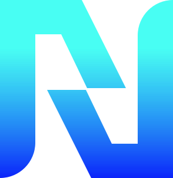
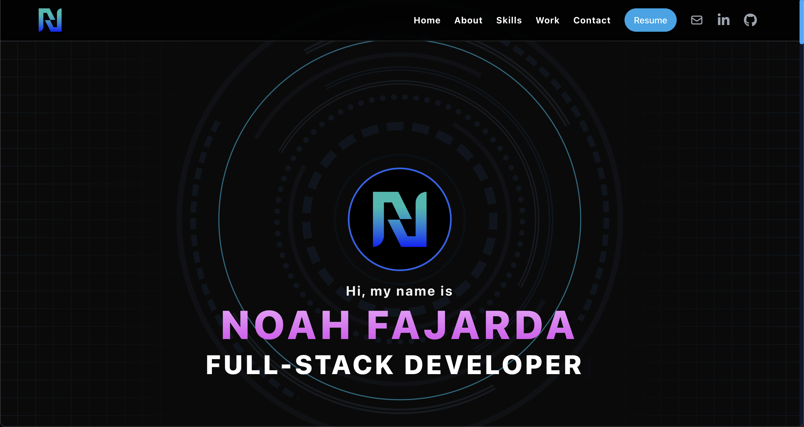

technologies used:

- react
- tailwind
- framer motion
- figma
- elasticemail (https://app.elasticemail.com/api/settings)
  - see amount of emails sent (https://app.elasticemail.com/api/activity)
  - Email usage plan (https://app.elasticemail.com/billing/emailapi/details)
  - use elasticeemail templates as html (https://app.elasticemail.com/api/templates/new?page=1&tab=1)

<div align="center">

#  **My Personal Portfolio**

### WebApp Link: <a href="https://noahfajarda.vercel.app/" target="_blank">https://noahfajarda.vercel.app/</a>

## My Personal Web Portfolio built with React.js.

</div>

<br />

## Tech Stack

<code></code>
&nbsp;
<code></code>
&nbsp;
<code></code>
&nbsp;

## Additional Technologies

-  React Router
-  Materialize

## Build Setup

```bash
# install dependencies
npm install

# runs the app in the development mode.
npm run start

# builds the app for production to the build folder.
npm run build
```

## Visuals

<div>



</div>

## Deploys

[](https://vercel.com/noahfajarda/noahfajarda/ESQHKg5rP8ToLqhcGxstsbYGTMD8)

## Licensing

[](https://opensource.org/licenses/MIT)

## Questions

If you have any questions or concerns, please contact me through my email below:

noahfajarda1@gmail.com

or through my github:

[https://github.com/noahfajarda](https://github.com/noahfajarda)
